# Arquitetura — Fynvex App

Este documento descreve a arquitetura do app mobile de antecipação de recebíveis para
profissionais de saúde (PJ) e como ele se integra ao backend e aos serviços externos. Os
requisitos por trás de cada decisão estão em
[`Especificacao-Requisitos-Fynvex.md`](./Especificacao-Requisitos-Fynvex.md) — os identificadores
entre parênteses (`RF-...`, `RNF-...`, `RN-...`) apontam para lá.

---

## 1. Visão geral

O app mobile é o único ponto de contato do representante da empresa com a Fynvex. Ele fala com um
único backend — a mesma aplicação Laravel que já sustenta o back-office web (`sistema-fynvex` /
`antecipacao-develop`) — através de um grupo novo de rotas (`/api/v1/app/*`, seção 4 da
especificação). Esse backend concentra toda a comunicação com os serviços externos; o app nunca
fala diretamente com um provedor de terceiro.

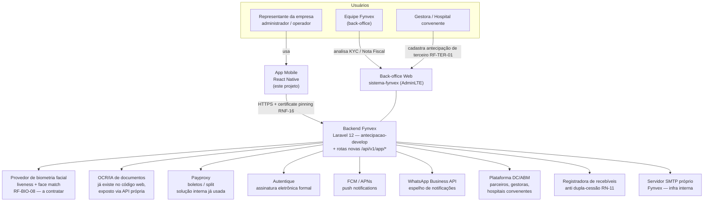

---

## 2. Arquitetura interna do app mobile

O app segue a mesma stack e organização de pastas do `payproxy-app` (decisão já tomada,
ver `CLAUDE.md`): telas puras, estado em Zustand, uma camada `api/` por domínio sobre um único
cliente HTTP com interceptors.

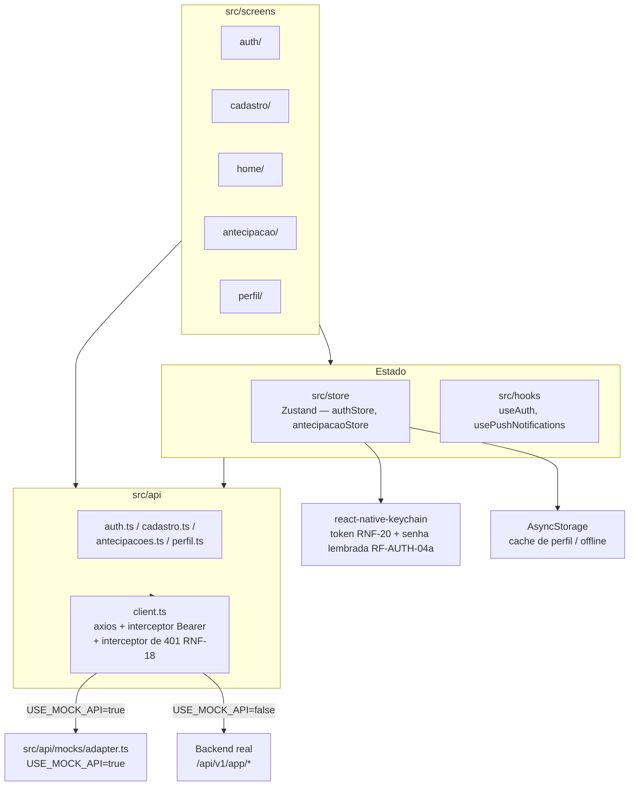

`client.ts` é o único lugar que decide entre mock e backend real — nenhuma tela ou store sabe
disso. Quando o backend real existir, a troca é `USE_MOCK_API=false` e a remoção de
`src/api/mocks/`, sem tocar em `src/api/*.ts` (que já falam o contrato real da seção 4) nem em
telas.

---

## 3. Onde as rotas novas entram no backend

Não há um novo serviço de backend. As rotas que o app consome entram como um grupo novo de
rotas/controllers dentro da mesma aplicação Laravel que já opera o back-office, reaproveitando o
mesmo banco de dados e as mesmas regras de negócio (motor de deságio, taxa administrativa,
modelos de Empresa/Sócio/Antecipação).

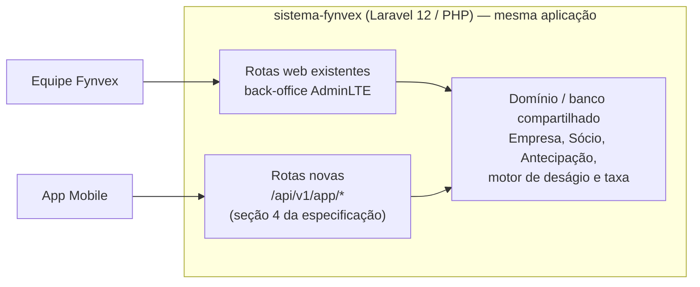

---

## 4. Fluxos detalhados

### 4.1 Autenticação (RF-AUTH-01 / RF-AUTH-04a)

Senha é pessoal (do representante) e, uma vez usada com sucesso num dispositivo, é lembrada — só a
leitura facial é pedida nos logins seguintes nesse mesmo dispositivo.

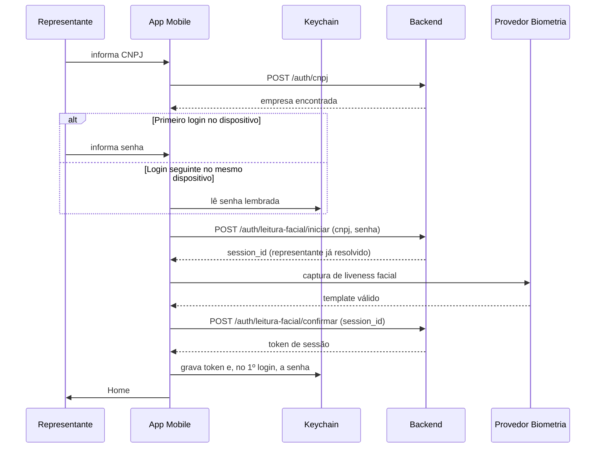

### 4.2 Cadastro e KYC (RF-CAD, RF-BIO-09, RF-KYC)

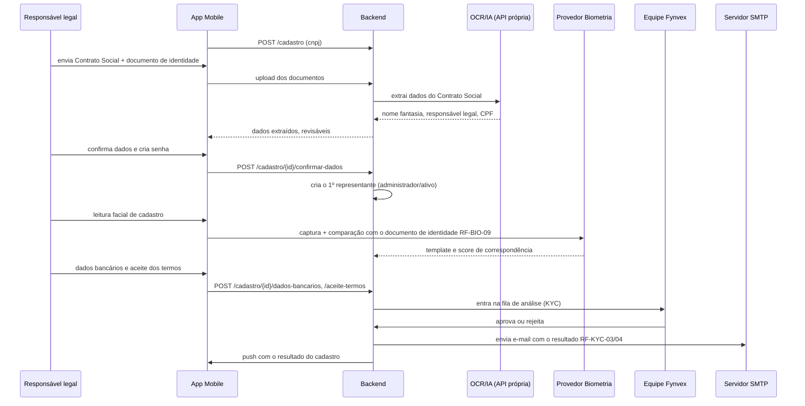

### 4.3 Antecipação self-service (RF-ANT, RF-PAG)

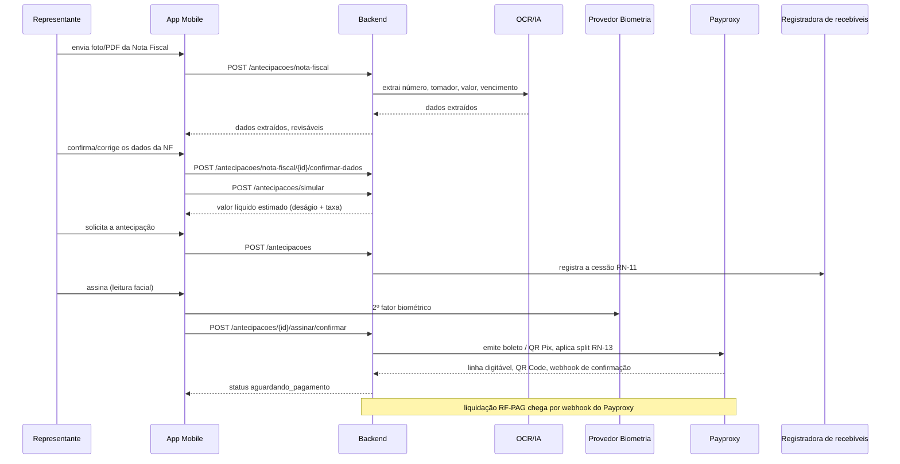

### 4.4 Antecipação originada por terceiro (RF-TER)

Uma gestora ou um hospital convenente cria a antecipação já preenchida no back-office; o
representante só revisa e decide.

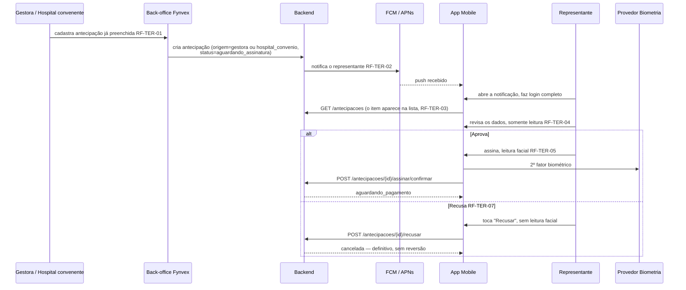

### 4.5 Recuperação de conta (RF-AUTH-08)

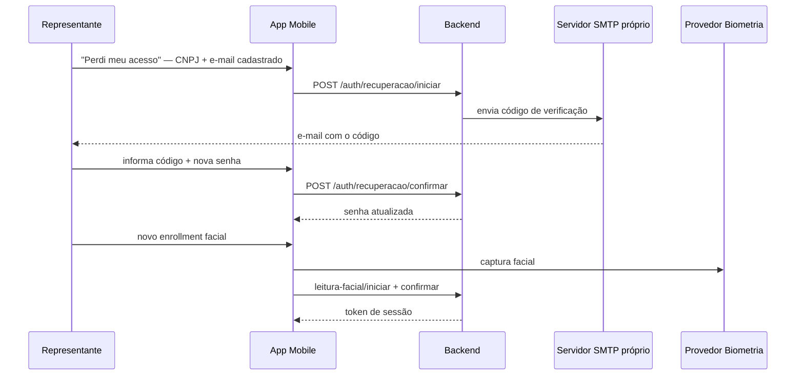

### 4.6 Convite de novo representante (RF-REP)

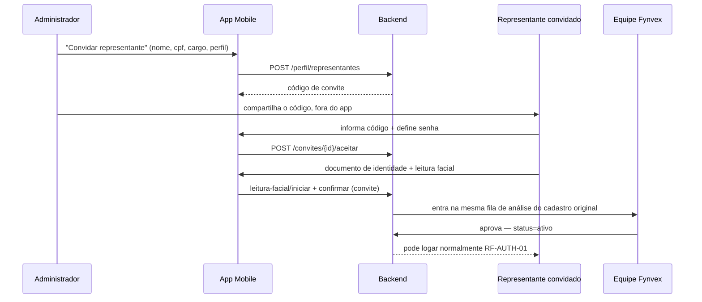

---

## 5. Modelo de dados essencial

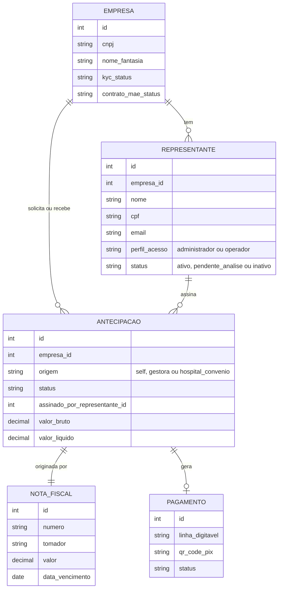

O ponto que esse modelo resolve: representante é pessoa, não é empresa/CNPJ. Sessão, senha e
template biométrico são todos por `REPRESENTANTE`; `EMPRESA` é só o titular do CNPJ e das
antecipações. `origem` é o que diferencia uma antecipação self-service de uma originada por
terceiro, sem precisar de uma tabela ou status paralelo — reaproveita o mesmo ciclo de vida
(seção 1.9 da especificação) nos dois casos.

---

## 6. Segurança do cliente móvel (seção 2.5 da especificação)

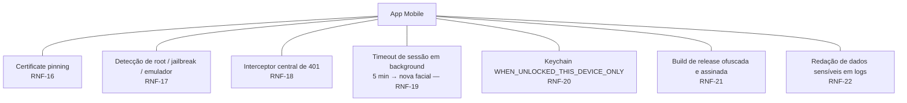

Cada um desses controles é independente dos demais — nenhum supre a ausência de outro. A seção 2.5
da especificação usa o `payproxy-app` como piso, não como teto: vários itens ali (biometria de app
implementada mas nunca acionada, timeout de sessão sem listener, build de release assinada com
keystore de debug) precisam ser corrigidos aqui, não só copiados.

---

## 7. Stack tecnológica

| Camada | Tecnologia |
|---|---|
| Framework | React Native 0.86.2 |
| Linguagem | TypeScript |
| Navegação | React Navigation 7 (`native`, `bottom-tabs`, `native-stack`) |
| Estado global | Zustand |
| Armazenamento seguro | `react-native-keychain` |
| Cache offline | `@react-native-async-storage/async-storage` |
| Push notifications | `@react-native-firebase/messaging` (FCM HTTP v1) |
| Ícones | `react-native-vector-icons/MaterialCommunityIcons` |
| HTTP | Axios via `src/api/client.ts` |
| Estilos | `StyleSheet.create` puro, sem biblioteca de UI externa |
| Backend | Laravel 12 / PHP — `sistema-fynvex` (`antecipacao-develop`) |

---

## 8. Integrações externas — o que precisa ser contratado

| Integração | Finalidade | Situação |
|---|---|---|
| Provedor de biometria facial (candidato: AWS Rekognition Face Liveness) | Liveness no login, 2º fator de assinatura, face match do documento de identidade (RF-BIO-09) | **A contratar** — única decisão de fornecedor de fato aberta |
| OCR/IA de documentos | Extração de dados do Contrato Social e da Nota Fiscal | Já existe como código na aplicação web da Fynvex; exposto ao app via API do próprio backend |
| Payproxy | Boleto, QR Pix, split (Fynvex + cashback do parceiro), webhook de confirmação | Já é uma solução interna, usada por outros produtos da Fynvex |
| Autentique | Assinatura eletrônica formal do Termo de Cessão e do Contrato-Mãe | Já integrado ao backend, orquestrado sem etapa visível no app |
| Firebase Cloud Messaging / Apple Push Notification service | Push notifications, inclusive as que levam à aprovação de antecipação de terceiro (RF-TER-02) | Padrão de mercado, mesma stack do `payproxy-app` |
| WhatsApp Business API | Espelho de notificações de status e canal de suporte N2 | A confirmar contratação/escopo |
| Plataforma DC/ABM, parceiros, gestoras e hospitais convenentes | Vínculo de parceiro, deep links, origem de antecipações de terceiro | Já existe, inteiramente no back-office |
| Registradora de recebíveis | Registro da cessão para prevenção de dupla cessão (RN-11) | Nome genérico na especificação — fornecedor específico ainda não escolhido |
| Servidor SMTP próprio da Fynvex | Código de recuperação de conta (RF-AUTH-08), e-mails de resultado de KYC (RF-KYC-03/04) | Já existe — infraestrutura interna, não um provedor novo |

A tabela completa, com o sentido de cada integração (entrada/saída/bidirecional), está na seção 5
da especificação — este documento acrescenta a coluna "situação" para deixar claro o que
efetivamente falta contratar.
