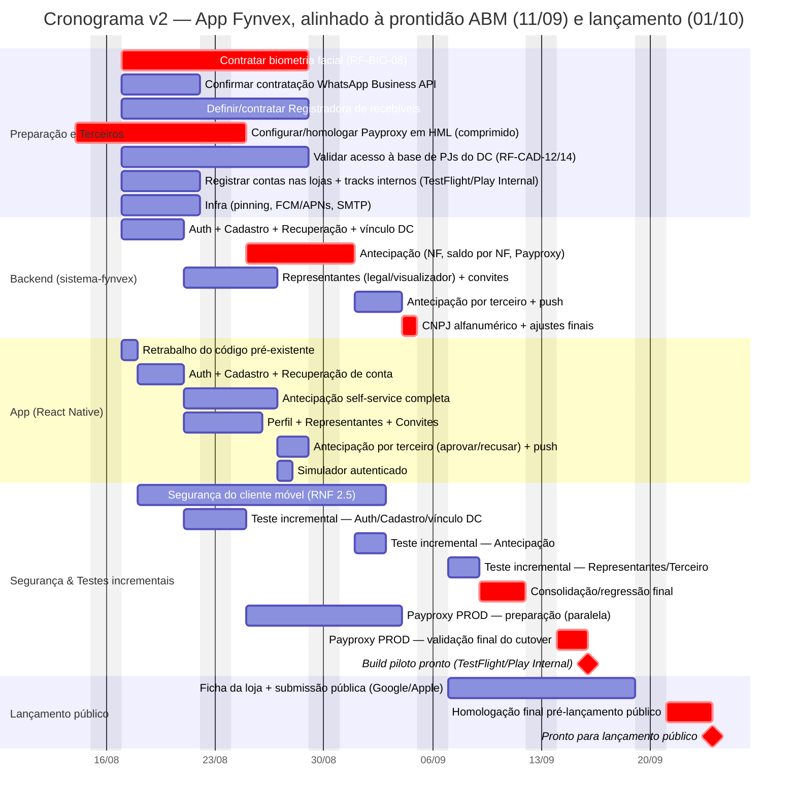

# Cronograma de Implementação — App Fynvex (v2 — ajustado à parceria ABM)

Esta é uma segunda versão de [`Cronograma-Fynvex.md`](./Cronograma-Fynvex.md) (v1), reorganizada
para tentar aproximar a prontidão técnica das datas assumidas por
[`documentação/Cronograma Fynvex-ABM.xlsx`](./documentação/Cronograma%20Fynvex-ABM.xlsx): Prontidão
operacional completa em **11/09/2026** e Lançamento oficial em **01/10/2026**. As premissas de
equipe, redução por IA e detalhamento funcional de cada fase são as mesmas da v1 — este documento
só re-sequencia datas e adiciona/separa tarefas. Não editar `Cronograma-Fynvex.md`/`.xlsx`
diretamente para isso — este é um terceiro documento, para comparação lado a lado.

## O que mudou em relação à v1

1. **Build piloto separado do build público.** O soft opening da ABM (14–30/09) é com 5–10 médicos
   selecionados — não precisa de publicação pública nas lojas. Passa a usar TestFlight (iOS) e
   Google Play Internal/Closed Testing (Android), que não têm a fila de revisão pública de ~10
   dias. A submissão pública (App Store/Google Play) continua existindo, mas só bloqueia o
   **Lançamento Oficial** (01/10), não o soft opening.
2. **MVP do piloto reduzido.** Fase 3 (Perfil/Representantes/Convites), Fase 4 (Antecipação por
   terceiro) e Fase 5 (Simulador autenticado) continuam sendo desenvolvidas, mas saem do que
   precisa estar testado/validado até 11/09 — entram no build público antes do lançamento oficial.
   Isso é decisão de negócio, não só técnica: precisa ser validado com o Rodrigo Firpo.
3. **Gate do Payproxy HML comprimido.** Início imediato (14/08, hoje) em vez de esperar a segunda-
   feira (17/08), com prioridade máxima sobre as demais aquisições da Fase 0: de 10 para 7 dias
   úteis. Isso puxa `be_ant` ~1 semana pra frente (era gateado por esse item na v1).
4. **Testes incrementais por fatia, não um bloco único no fim.** Cada fatia do backend (Auth,
   Antecipação, Representantes/Terceiro) é testada contra o app assim que sai, em vez de esperar
   `be_fim` para começar um bloco de 6 dias. O bloco final vira uma consolidação/regressão curta.
5. **Payproxy em produção preparado em paralelo aos testes**, não sequencialmente depois — só a
   validação final do cutover acontece depois da consolidação de testes.
6. **Duas tarefas novas, com dependência externa própria** (mesmo tratamento dado a
   biometria/WhatsApp/Registradora na Fase 0): validação de vínculo contra a base de PJs do DC
   (RF-CAD-12) e definição do contrato de deep link da plataforma do DC (RF-CAD-14). Na v1 estavam
   diluídas dentro do "Auth + Cadastro" genérico, sem prazo nem dono próprios.

**O que fica de fora desta v2, por ser conflito de escopo e não de prazo** (ver análise anterior):
integração com o dashboard/botão de antecipação do DC, módulo de prestação de contas do DC e
cadastro multiparceiro/comissão — a especificação marca isso como "Fora de Escopo" (backoffice).
Se a ABM espera isso pronto até 11/09, é uma conversa de escopo com o Rodrigo Firpo, não algo que
compressão de cronograma resolve.

## Maior incerteza desta versão

Os itens 3 e 4 acima (compressão do Payproxy HML de 10→7 dias, e o bloco final de testes indo de
6→3 dias) são as duas hipóteses mais otimistas deste documento — nenhuma tem evidência real ainda,
igual o corte de produtividade do Backend já sinalizado na v1. Recalibrar assim que a configuração
do Payproxy em HML começar de fato.

## Diagrama

## Comparação de marcos: v1 × v2 × ABM

| Marco | v1 (original) | v2 (esta versão) | ABM espera |
|---|---|---|---|
| `be_ant` inicia | 31/08 | **25/08** | — |
| Backend completo (`be_fim`) | 10/09 | **04/09** | (implícito em "app pronto" 28/08) |
| Build utilizável para piloto | não existe como marco separado | **~11/09** (TestFlight/Play Internal) | Prontidão operacional: **11/09** |
| Submissão pública às lojas | 11/09 → 24/09 | 07/09 → **18/09** | Submissão: 01/09 / Publicação: 11/09 |
| Pronto para lançamento público | 30/09 (go-live, 1 dia de folga) | **~23/09** (~1 semana de folga) | Lançamento oficial: **01/10** |

A v2 chega perto da data de prontidão da ABM (11/09) só porque desacopla o piloto da revisão
pública de loja — sem essa mudança de estratégia de distribuição, nenhuma compressão de
desenvolvimento razoável fecha esse gap de 3 semanas.

## O que precisa ser confirmado antes de tratar isto como plano válido

- **Decisão de negócio**: a ABM aceita que o piloto (14–30/09) rode sem Representantes/Convites,
  sem Antecipação por Terceiro e sem Simulador autenticado? Se não, o MVP do piloto volta a ser o
  escopo completo e o gap de prazo volta a existir.
- **Viabilidade real da compressão do Payproxy HML** (10→7 dias) — depende do provedor, não só da
  Fynvex.
- **Viabilidade dos testes incrementais** (6→3 dias no bloco final) — só se sustenta se cada fatia
  for de fato testada assim que sai, com disciplina, não só no papel.
- **Configuração das tracks internas (TestFlight / Play Internal Testing)** precisa existir e ser
  testada com antecedência — não é automática só por ter conta de desenvolvedor criada.
