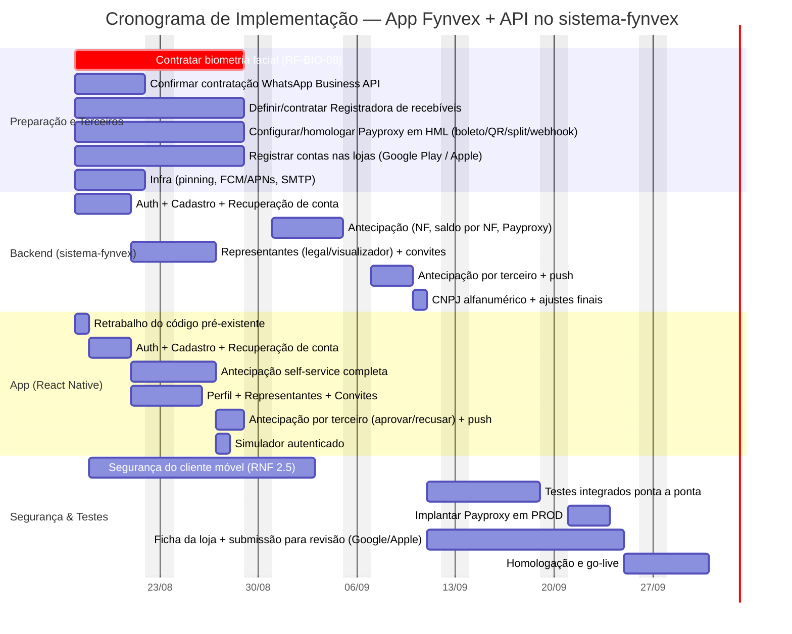

# Cronograma de Implementação — App Fynvex

Cronograma das atividades para implementar o app mobile (`src/`) e as modificações no backend
real (`sistema-fynvex/antecipacao-develop`) — os novos endpoints da seção 4 de
[`Especificacao-Requisitos-Fynvex.md`](./Especificacao-Requisitos-Fynvex.md), como novas
rotas/controllers dentro da mesma aplicação Laravel (não é um serviço novo).

## Premissas

- **Equipe**: uma dupla dedicada — 1 desenvolvedor mobile (React Native) e 1 desenvolvedor backend
  (Laravel) — trabalhando em paralelo sobre o contrato já fechado na seção 4. Com equipe maior,
  as fases marcadas como paralelas entre si (Backend/App) continuam paralelas, mas as durações
  encolhem; com equipe menor, o caminho crítico se estende.
- **Ponto de partida real**: parte do código do app já existe, mas foi escrito **antes** das
  decisões desta sessão (modelo de perfis `administrador`/`operador`, NF com cessão única) — esse
  código precisa de retrabalho, não é reaproveitável direto (ver Fase 1).
- **Bloqueio externo**: a contratação do provedor de biometria facial (RF-BIO-08) é a única
  dependência de fornecedor externo que bloqueia a homologação final — sem ela, a assinatura
  (2º fator facial) não funciona de ponta a ponta contra o backend real (o app já roda hoje
  contra mock, `USE_MOCK_API=true`, então isso não bloqueia o *desenvolvimento*). Há mais duas
  aquisições de terceiro na Fase 0 (WhatsApp Business API, Registradora de recebíveis), mas
  nenhuma delas bloqueia o caminho crítico — ver Fase 0.
- **Payproxy não é uma contratação nova** — é uma solução interna já usada por outros produtos
  Fynvex (ver `Arquitetura-Fynvex.md` seção 8). O que este cronograma trata como atividade é a
  **configuração/integração** do fluxo específico do app (boleto, QR Pix, split, webhook de
  liquidação) em homologação (HML) e, depois, em produção (PROD) — não uma aquisição de
  fornecedor.
- Datas de início: 17/08/2026 (próxima segunda-feira útil a partir de hoje).
- **Backend não espera a Preparação terminar**: só a fatia de biometria dentro de "Auth +
  Cadastro" (cadastro biométrico, RF-BIO-01, e a leitura facial de fim de recuperação, RF-AUTH-08)
  depende do provedor contratado — o resto (endpoints de CPF/senha, cadastro, etc.) não depende de
  nada da Fase 0. Como a contratação (10 dias úteis) termina bem antes do bloco de "Auth +
  Cadastro" mesmo começando os dois no mesmo dia, o backend começa em paralelo à Preparação em vez
  de esperar `prep_bio` terminar.
- **Duração das atividades de implementação com uso de IA (Claude Code)**: as durações de
  desenvolvimento (App e Backend, seção "Segurança & Testes") **foram reduzidas** em relação a uma
  estimativa de ritmo 100% manual, com base no que se observou na prática nesta mesma sessão — o
  retrabalho completo do login (CPF+senha, sem facial) e, na mesma sessão, a implementação de
  Perfil/Gerenciar Representantes/Convites (2 fluxos, restruturação de navegação pra bottom-tabs,
  ~15-20 arquivos entre os dois) foram feitos de ponta a ponta contra um contrato de API já
  fechado. A redução **não é uniforme**, e o App e o Backend passaram por uma segunda rodada de
  corte, explicitamente mais agressiva do que a recomendação original:
  - **App**: redução de **~75-80%** sobre a estimativa manual original — dois exemplos reais na
    mesma sessão (login completo, e Perfil/Representantes/Convites) sustentam isso; o padrão se
    repetiu. Ainda assim, vale registrar: **esse corte específico não afeta a data de go-live** —
    o App tem mais de 5 semanas de folga antes do Backend terminar, então reduzir mais isso só
    libera o desenvolvedor mobile mais cedo pra outra coisa, não acelera o projeto.
  - **Backend**: redução de **~70-75%**, **por decisão explícita, não por evidência real** — até
    aqui, zero linha de código foi tocada em `sistema-fynvex` (Laravel) nesta sessão. Diferente do
    corte do App, este **move a data de go-live** (~2,5 semanas mais cedo). É a parte da estimativa
    com maior risco de estar errada, pra qualquer lado — recalibrar assim que o backend real
    começar é ainda mais importante depois deste corte do que antes dele.
  - **Segurança do cliente móvel** (`sec`): recalculado pra **12 dias** (era 25) — não por
    velocidade de IA, mas porque **3 dos 7 itens da seção 2.5 já saíram prontos como efeito
    colateral do resto do trabalho desta sessão**, confirmado no código: RNF-18 (interceptor
    central de 401 → `forceLogout`, em `client.ts`) e RNF-20 (Keychain de token + senha lembrada,
    em `useAuth.ts`) já existem e funcionam; RNF-19 (nenhuma verificação extra ao voltar do
    background) já está satisfeito por decisão de spec, não precisa de código novo. Os 4 que
    realmente faltam — RNF-16 (pinning), RNF-17 (detecção de root/jailbreak), RNF-21 (keystore de
    produção real + ofuscação — o `minifyEnabled` já existe no `build.gradle`, mas só como
    scaffold, sem keystore real) e RNF-22 (redação de log) — continuam precisando de verificação em
    dispositivo real pra pinning/root, por isso a redução aqui é mais modesta que no App/Backend.
  - **Testes integrados**: mantido na redução original (~40%) — investigar e corrigir bugs de
    integração contra o backend real não compila mais rápido só porque o código saiu mais rápido.
  - **O que continua sem redução**: tudo que não é trabalho de desenvolvimento — contratação de
    fornecedor, revisão de KYC, revisão da App Store, homologação/sign-off, implantação em PROD.
    IA não acelera negociação com terceiro nem fila de revisão de loja — e é justamente por isso
    que a submissão às lojas volta a disputar o posto de gargalo com o Backend nesta versão (ver
    Caminho crítico).

## Fases

### Fase 0 — Preparação e Aquisição de Serviços de Terceiros (paralelo, ~2 semanas)
- Contratar provedor de biometria facial (RF-BIO-08) — **bloqueante** para homologação.
- Confirmar contratação e escopo do WhatsApp Business API (RF-PUSH-04/RF-SUP-01) — espelhamento
  de notificações de status e canal de suporte N2.
- Definir e contratar a Registradora de recebíveis (RN-11) — fornecedor específico ainda não
  escolhido na especificação (nome genérico). Necessário só quando o tipo de ativo antecipado
  exige registro anti dupla-cessão; não bloqueia as demais fases se o MVP cobrir apenas ativos
  que não exigem esse registro.
- **Configurar e homologar a integração com o Payproxy em ambiente de homologação (HML)**:
  credenciais de acesso, emissão de boleto/QR Pix, split (Fynvex + cashback do parceiro) e o
  webhook de confirmação de liquidação (RF-PAG-04) — não é contratação (Payproxy já existe e é
  usado por outros produtos Fynvex), é configuração/integração do fluxo específico deste app.
- Infraestrutura: certificado TLS para pinning (RNF-16), credenciais FCM/APNs, confirmação do
  servidor SMTP próprio para os e-mails de recuperação/KYC/convite de visualizador.
- Validar com o time de infraestrutura o hash de chave pública a pinar (ver dúvida já respondida
  sobre certificate pinning) e o processo de rotação antes do primeiro release.
- **Registrar as contas de desenvolvedor nas lojas** (Google Play Console, Apple Developer
  Program) — antecipar aqui porque a verificação (principalmente da Apple, que pode exigir
  D-U-N-S da empresa) leva alguns dias e não pode ficar pra última hora, sob risco de travar o
  go-live só por burocracia de conta.

### Fase 1 — Retrabalho + Fundação: Autenticação e Cadastro (~1,5 semana, com IA)
**Backend**: endpoints `/auth/cnpj`, `/auth/leitura-facial/*`, `/auth/recuperacao/*`,
`/cadastro/*` (RF-CAD, RF-KYC); exposição do OCR/IA existente na aplicação web via API própria
(RF-CAD-05); integração com o provedor de biometria (login + validação facial do documento,
RF-BIO-09); suporte a CNPJ alfanumérico (RF-AUTH-02a/RF-CAD-01a) — já sinalizado que
`Utils::validaCPF` não pode ser reaproveitada como está.

**App**: retrabalhar `types/index.ts`, `fixtures.ts` e os mocks de auth/cadastro/perfil já
escritos para o modelo antigo (`administrador`/`operador`) → `representante_legal`/`visualizador`;
telas de CNPJ, Senha, Captura Facial, Welcome Back, Cadastro (docs, revisão IA, dados bancários,
termos), Recuperar Conta.

*Backend e App avançam em paralelo, ambos sobre o contrato da seção 4 — o app não depende do
backend estar pronto para progredir (mock já cobre isso).*

### Fase 2 — Antecipação Self-Service (~2 semanas, com IA, após Fase 1)
**Backend**: `/contrato-mae/*`, `/antecipacoes/nota-fiscal/*`, `/antecipacoes` (criar, simular,
assinar, cancelar); regra de **saldo por Nota Fiscal** (RN-11 — a mudança mais recente: mesma NF
pode lastrear mais de uma solicitação, limitado ao saldo); integração Payproxy (boleto/QR/split);
extensão do `CriarDocumentoAssinaturaJob`/`AssinaturaService` já existentes para os novos
gatilhos de Contrato-Mãe/Borderô a partir do app.

**App**: fluxo completo de nova solicitação (upload NF, revisão com `valor`/`valor_solicitado`
distintos, simulação, assinatura com renderização nativa do texto — RF-ANT-07a — tela de
pagamento), Home/lista de status.

### Fase 3 — Perfis de Acesso e Múltiplos Representantes (~2 semanas, com IA, em paralelo à Fase 2)
**Backend**: CRUD de `/perfil/representantes`; dois fluxos de convite (`representante_legal` com
Procuração + KYC completo; `visualizador` com código por e-mail, sem biometria); RN-15/RN-16
(nunca ficar sem representante legal ativo; revogação de sessão ao remover).

**App**: telas de Perfil, Gerenciar Representantes, Convidar Representante (2 fluxos), tela de
aceite de convite, login separado do visualizador (e-mail + senha, sem CNPJ/facial — RF-REP-08).

*Pode rodar em paralelo à Fase 2 — modelos de dados não conflitam (representante vs. antecipação)
— mas ambas dependem da Fase 1 (login/sessão) estar pronta.*

### Fase 4 — Antecipação Originada por Terceiro (~1 semana, com IA, após Fase 2)
**Backend**: endpoint de recebimento de antecipação já preenchida (gestora/hospital convenente,
RF-TER-01), disparo de push (RF-TER-02), `POST /antecipacoes/{id}/recusar`.

**App**: tela de aprovação/recusa (somente leitura + facial só na aprovação, recusa sem facial),
integração com push recebido, item na Home com ação diferenciada.

### Fase 5 — Simulador Autenticado e Ajustes Finais (poucos dias, com IA, após Fase 2)
RF-SIM-04 — simulador acessível logado, com valores pré-preenchidos editáveis na revisão da NF.

### Fase 6 — Segurança do Cliente Móvel (transversal, RNF 2.5)
Certificate pinning (RNF-16), detecção de root/jailbreak (RNF-17), interceptor central de 401
(RNF-18), timeout de sessão em background (RNF-19), keychain (RNF-20), build de release
ofuscada/assinada (RNF-21), redação de dados sensíveis em log (RNF-22). Começa logo após a Fase 1
(a maior parte depende só do `client.ts` e do `authStore` existirem) e é revalidada até o fim —
não é algo que se faz só na última semana.

### Fase 7 — Testes Integrados, Homologação e Go-Live (~3 semanas, após Fases 2/3/4 concluídas)
Testes ponta a ponta contra o backend real (não mock) — inclusive os dois fluxos de convite, a
recusa de terceiro, a recuperação de conta por e-mail e o saldo parcial de NF; ajustes finais;
troca de `USE_MOCK_API=true` para `false` e remoção de `src/api/mocks/`.

**Implantação do Payproxy em produção (PROD)**: só depois que os testes integrados em HML
passarem, a configuração de credenciais/split validada na Fase 0 é replicada para o ambiente de
produção do Payproxy. É um gate explícito antes do go-live — sem ele, o app entraria em produção
sem conseguir gerar boleto/QR Pix real nem receber o webhook de liquidação.

**Publicação nas lojas**: com a conta de desenvolvedor já pronta desde a Fase 0, preparar a ficha
da loja (descrição, capturas de tela, política de privacidade) e submeter o app para revisão na
Google Play e na App Store — em paralelo aos testes integrados, não depois deles, porque a
revisão da Apple é a atividade de duração mais incerta de todo o cronograma (pode ir de 1 dia a
mais de uma semana, inclusive com rejeição e resubmissão) e não deveria ficar sequencialmente
atrás de mais nada evitável.

## Diagrama

## Caminho crítico

Com o segundo corte (App e Backend também reduzidos ~50% em relação à primeira rodada de IA — ver
Premissas), o caminho crítico muda de composição outra vez:
- **`payproxy_hml` (Fase 0) passa a gatear o Backend, não mais o contrário**: `be_ant` depende de
  `be_auth` (termina 20/08) **e** de `payproxy_hml` (termina 28/08) — com o Backend tão mais rápido
  agora, é a configuração/homologação do Payproxy que determina quando `be_ant` pode começar
  (31/08), não a velocidade de `be_auth`. Mais uma vez, o gargalo migra pro que não acelerou.
- Backend: preparação → auth/cadastro (4d) → antecipação (5d, gateada por `payproxy_hml`) →
  terceiro (3d) → ajustes finais (1d) → **10/09/2026**, então testes integrados (6d) +
  implantação do Payproxy em PROD (3d) → **23/09/2026**.
- Lojas: ficha da loja + submissão (10d), correndo em paralelo desde o mesmo ponto (10/09) →
  **24/09/2026** — **1 dia depois** do backend+Payproxy, mesma margem estreita de antes.

A homologação só pode começar em 25/09/2026 (dia útil seguinte ao maior dos dois), terminando o
go-live em **30/09/2026**.

**Risco a monitorar, maior do que antes**: a duração de `lojas_submissao` (10 dias) é uma
estimativa otimista para a **primeira** submissão à App Store — rejeições da Apple (metadata,
política de privacidade, funcionalidade incompleta) são comuns e cada rodada de revisão pode levar
de 1 a vários dias. Como essa atividade já é, na estimativa nominal, o fator mais lento do fim do
cronograma, qualquer atraso nela se traduz **diretamente** em atraso do go-live — não há mais
folga do backend absorvendo isso. Com o Backend agora tão comprimido, esse risco pesa
proporcionalmente mais do que antes.

Total estimado: **~6 semanas** a partir de 17/08/2026 — go-live em **30/09/2026** —, supondo os
ganhos de produtividade com IA descritos nas Premissas (incluindo o corte adicional de ~50% em
App e Backend, este último **sem nenhuma evidência real ainda** — é a maior incerteza desta
versão do cronograma) e a submissão às lojas sem rejeição. Recalibrar assim que o
backend real começar e a primeira submissão às lojas tiver ocorrido — nessa ordem, porque o
backend é a maior incerteza da estimativa e a submissão às lojas é a mais provável de definir o
atraso, se houver algum.
